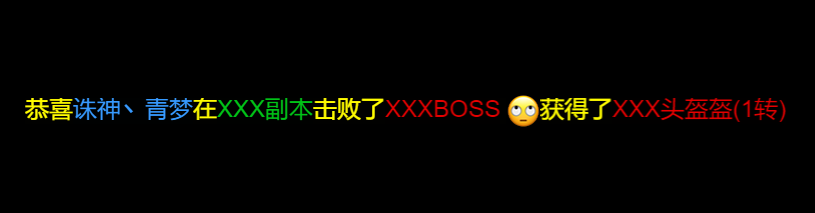

### 用Label和Sprite简单实现的一个RichText

由于CocosCreator更新2.0之后RichText性能极低，复杂点的聊天界面在低性能手机上几乎无法正正常使用，初始化十几条要卡顿秒级，所以使用了RichText相同的parser，意味着如果你以前用的是RichText，可以无缝切换至此组件。

---
### 已实现

- 文字颜色
- 文字下划线
- 点击事件
- 图片

### TODO:
换行处理需要修改，当前以块为单位换行，需要改成切断label的方式。